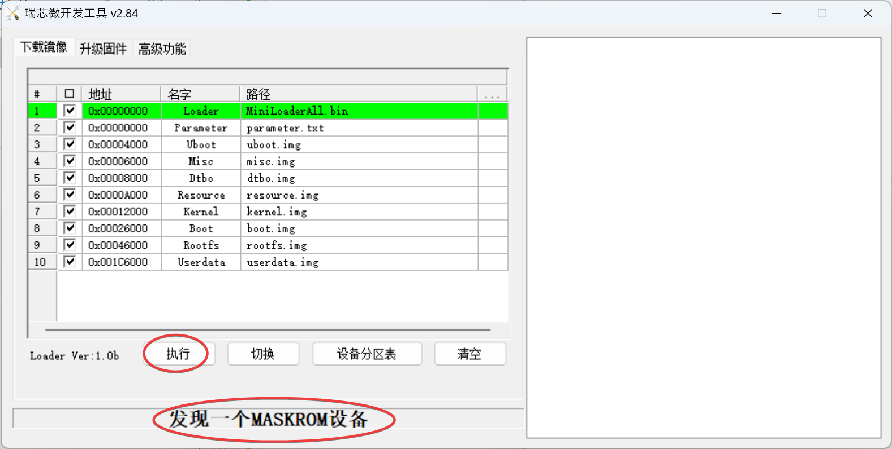

# NanoPC T6 homeserver setup scripts

The goal of this project was to provide a home server with the following properties:

- The services of this home server can be accessed both internally and externally.
- The server does not depend on a fixed IP address so it can be used on a regular internet subscription.
- The server is mobile and you can take it with you. Just turn it on and it will work.
- All connections are over https, both internally and externally.
- Setup is modular and adding new services is easy.
- Backups are automatic and in the cloud, so that if the device is lost or broken, your data is always recoverable.

This repository contains instructions and scripts that implement this as follows:

- Traefik is used for proxying and requesting letsencrypt certificates.
- Cloudflare is used for tunneling (zero trust). This also means that DNS is hosted on Cloudflare. This is not only important for the tunneling to work, but also for the letsencrypt certificates, which will use DNS challenges. (We must use DNS challenges since the Let's Encrypt HTTP challenges don't pass through the Cloudflare tunnel) A free account is sufficient.
- Backups are stored on Backblaze. At 6$/TB/month, they're cheap and reliable.

What kind of services can this home server host? Anything that is available as docker image, essentially, which in my case includes:

- Seafile as Dropbox/Google Drive alternative
- Vaultwarden (compatible with Bitwarden clients) for password storage
- Joplin to keep notes
- Plex for media streaming
- Photoprism for viewing and organizing photo's
- Samba for file storage
- Gitea for git repositories
- NocoDB as Airtable alternative

## Hardware used

You'll need the following hardware:
- A NanoPC-T6 (I used the version with metal case)
- An NVMe SSD drive. Not all drives work: Samsung 970 and 990 SSD drives are known to work. A WD Blue SN570 2TB did not work at all.
- An USB-C cable. The NanoPC-T6 has a Type C port that is also used when flashing, so make sure you are able to connect it to your PC.

Devices similar to the NanoPC-T6 may work with these scripts as well, but have not been tested. I used the NanoPC-T6 since it has 2 ports (can be used as router), a powerful yet energy-efficient processor (RK3588) and an NVMe slot for storage. I picked the 16GB version. 8GB may also be sufficient.

This setup assumes that the device will be used as a router, using a device as a separate server on an internal network requires a completely different setup.

## Other prerequisites

- You need a Windows laptop or PC with a LAN port (or LAN port adapter). You also need a wired LAN connection at your desk.
- You'll need Putty installed
- A BackBlaze account, for the backups.

## Flashing the NanoPC-T6

See [the FriendlyElec wiki](http://wiki.friendlyelec.com/wiki/index.php/NanoPC-T6) for details

Download the necessary software from [the FriendlyElec Google Drive folder](https://drive.google.com/drive/folders/1FoBbP_nPkMehwBj4wHwsbRU-QGjEdeEP):
- 01_Official images/03_USB upgrade images/rk3588-usb-friendlywrt-23.05-docker-20231031.zip (or a newer version, but make sure it's the version with docker included)
- 05_Tools/DriverAssitant_v5.1.1.zip

Setup these tools:
- Extract the driver assistant and run DriverInstall.exe
- Extract the image zip file

Flashing:
- Prepare the power adapter
- Push the MASK button with a paperclip
- Insert the power adapter while holding the MASK button
- Wait for 3 seconds
- Release the MASK button
- Connect the NanoPC with your PC (I connected USB-C to USB-C)
- Open the RKDevTool.exe bundled with the official image
- Check that it found the device: it should show "发现一个MASKROM设备" (see screenshot below). If no device was discovered, it will show "没有发现设备" instead and you'll have to try again.
- Click the 执行 ("execute") button (see screenshot below)
- Wait until finished
- You can now disconnect the USB cable



Connecting to PC:
- Connect ETH1 (WAN port) to a wired connection in your house
- Connect ETH2 (LAN port) to your PC
- Test by going to http://friendlwrt , username "root", pasword "password"

## Preparation

Make sure you have the following available:
- Your own domain name
- A BackBlaze account to store backups
- A CloudFlare account to host the DNS and tunnel

If you don't already have a domain name, get one. If your domain is mydomain.net, then the services will become direct subdomains eg. joplin.mydomain.net, seafile.mydomain.net and so on. If you want second-level subdomains (such as seafile.mybox.mydomain.net) a paid Cloudflare subscription is required. Otherwise, a free subscription will be sufficient.

### Preparing the BackBlaze account

For BackBlaze, you'll need to register a B2 account ([Register](https://www.backblaze.com/sign-up/cloud-storage?referrer=getstarted)). This account will be used in the steps described below.

### Preparing the Cloudflare account

If your domain name is not registered via Cloudflare, make sure to set CloudFlare as your DNS provider:

- First login to your Cloudflare account. Then under Websites, create a new website.
- Select the Free plan
- Cloudflare will attempt to import all your existing DNS records. Review it and double-check that everything is correct. You may also need to disable the proxy on some of your subdomains in the following cases:
	- you have second level subdomains that are not covered by the certificate in the free plan
	- if you need http access for domains that use Letsencrypt certificates with HTTP challenges.
- Continue
- Follow the instructions presented to update your DNS settings on your domain registrar.

Make sure these steps are completed BEFORE attempting to setup the tunnel and proxy. Otherwise both the tunneling and the Letsencrypt certificates will NOT work.

### Setting up the tunnel in Cloudflare

- In your CloudFlare dashboard, go to the Zero Trust section.
- Select Access -> Tunnels
- Create a tunnel
- Give the tunnel a name and save it
- Copy the command shown in "Run the following command" somewhere. Remove the "cloudflared.exe service install" command, you only need the token without anything else.

### Creating the DNS and Zone application keys

In order for Traefik to setup the DNS records for the Letsencrypt challenges, it must first have the necessary API keys. These are configured as follows:

- Go to your [API Tokens](https://dash.cloudflare.com/profile/api-tokens) via your profile icon at the top -> My Account -> API Tokens
- Create a token to read all zones:
	- Create Token
	- Create Custom Token (Get started)
	- Enter a name (eg. "View all zones")
	- Permissions: Zone - Zone - Read
	- Continue to summary
	- Create token
	- Copy the token somewhere (and remember that this is the Zone API key!)
	- Go back to View all API tokens
- Create a token to edit your DNS:
	- Create token
	- Edit zone DNS - Use template
	- Zone Resources: Include - Specific zone - select your domain name
	- Continue to summary
	- Create token
	- Copy the token somewhere (and remember that this is the DNS API key!)

## Preparing the device

Setup the device:
- Open Putty and connect to "friendlywrt", username `root` password `password`
- Check out the setup repository on it:

```
git clone https://github.com/stanhebben/nanopc-homeserver.git
cd nanopc-homeserver
```

- If the SSD in your device has never been formatted before, run `bash 1-format-ssd.sh` which will setup the partition table an ext4 partition on it
- Run `bash 2-setup.sh`
- Enter your new root password

### Setting up automatic backups via BackBlaze

- Login to your BackBlaze acount
- If you don't already have a bucket to store your backups, create one here and remember the name.
- Go to Application Keys (under the Account section in the left navigation)
- Add a new application key
- Restrict it to the backup bucket only
- Give it a name and press "Create new Key"
- The key ID and key will appear in a blue box
- Go back to your Putty SSH session
- Run `bash 3a-backups-backblaze.sh`
- Copy and paste (right click to paste) the Key ID of the newly generated key and press enter
- Copy and paste the key and press enter
- Enter the bucket name
- Choose a password for the backups (if restoring a backup, you **must** use the same password as the backup you're restoring from)

### Completing setup

- Perform some checks to see if everything works correctly so far:
	- Browse to http://friendlywrt:8000 with your browser - username is root and password is the one you just chose. It should show the configuration page.
	- Run `lsblk` to check that your SSD is correctly mounted - it should show an `nvme0n1p1` partition mounted to `/mnt/ssd`
- Reboot the device: `reboot`
- Login to the device again and go back to the nanopc-homeserver directory

## Initializing a new system

If you're setting up a new system, follow these instructions. If restoring from a backup, use the instructions under "Restoring a backup" instead.

- Start setup of the local app proxy: `bash 4a-initialize.sh`. Keep your generated CloudFlare keys and Tunnel token ready, this script will ask for them.
- Then you can setup each service with `bash install.sh <service>`:
  - `gitea` - git repository
	- `joplin` - note keeping
	- `mstream` - music streaming
	- `photoprism` - to browse your photos
	- `seafile` - file storage (Dropbox / Google drive alternative)
	- `vaultwarden` - resource-efficient Bitwarden alternative
- For each service you want to be externally accessible, you'll also have to add an entry to your Cloudflare tunnel configuration:
	- From your BackBlaze dashboard, go to Zero trust -> Access -> Tunnels
	- Next to your tunnels, press the ... icon and select "Configure"
	- Go to the "Public hostname" tab
	- Add a public hostname
	- Subdomain = enter the subdomain you wish to add
	- Select the domain you're working with
	- Path must be left empty
	- Type = HTTP
	- URL:
	  - `gitea`: `gitea:3000`
		- `joplin`: `joplin:22300`
		- `mstream`: `mstream:3000`
		- `photoprism`: `photoprism:2342`
		- `seafile`: `seafile`
		- `vaultwarden`: `vaultwarden`

## Restoring a backup

The system will automatically take nightly backups (at 2:00 AM by default). `restic` is used to make the backups - they are end-to-end encrypted (BackBlaze can't read your data) and snapshots are kept for 14 days by default. Update the `/mnt/ssd/backup.sh` script if you want to change which snapshots are kept.

Restoring a backup is easy: run `bash 4b-restore.sh` and everything will be restored from the BackBlaze backup.

This also works if you are able to recover some of the files. In that case, put the files in their proper place before restoring the backup. For instance, if you have an old offline backup, you can copy that first (to save time and bandwidth) and then perform automatic restore.
